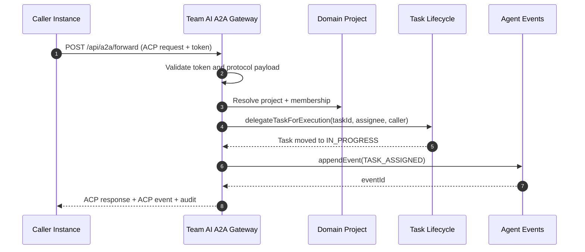

# ACP + A2A Minimal Gateway

This document describes the minimal ACP + A2A gateway in Team AI.

## Endpoint

- `POST /api/a2a/forward`
- Header: `X-A2A-Token: <shared-token>`

## ACP Message Contract

### Request

```json
{
  "protocolVersion": "1.0",
  "requestId": "req-forward-1",
  "sourceInstance": "instance-alpha",
  "actorUserId": "user-1",
  "projectId": "project-1",
  "messageType": "TASK_FORWARD",
  "payload": {
    "taskId": "task-1",
    "assigneeAgentId": "agent-assignee",
    "callerAgentId": "agent-caller",
    "note": "forward this task"
  },
  "timeoutMs": 5000,
  "retryLimit": 1
}
```

### Success Response

```json
{
  "traceId": "f47ac10b-58cc-4372-a567-0e02b2c3d479",
  "requestId": "req-forward-1",
  "status": "SUCCESS",
  "response": {
    "kind": "response",
    "type": "TASK_FORWARD_ACK",
    "id": "task-1",
    "payload": {
      "projectId": "project-1",
      "taskId": "task-1",
      "assigneeAgentId": "agent-assignee",
      "attempts": 1
    },
    "occurredAt": "2026-03-03T10:00:00Z"
  },
  "event": {
    "kind": "event",
    "type": "TASK_ASSIGNED",
    "id": "event-forward-1",
    "payload": {
      "projectId": "project-1",
      "taskId": "task-1",
      "callerAgentId": "agent-caller",
      "assigneeAgentId": "agent-assignee",
      "sourceInstance": "instance-alpha"
    },
    "occurredAt": "2026-03-03T10:00:00Z"
  },
  "error": null,
  "audit": {
    "sourceInstance": "instance-alpha",
    "actorUserId": "user-1",
    "projectId": "project-1",
    "messageType": "TASK_FORWARD",
    "attempts": 1,
    "latencyMs": 24,
    "occurredAt": "2026-03-03T10:00:00Z"
  }
}
```

### Error Response

```json
{
  "traceId": "f47ac10b-58cc-4372-a567-0e02b2c3d479",
  "requestId": "req-forward-1",
  "status": "ERROR",
  "response": null,
  "event": null,
  "error": {
    "code": "A2A_PROTOCOL_INVALID",
    "message": "messageType must be TASK_FORWARD, but was PING",
    "retryable": false,
    "retryAfterMs": 0
  },
  "audit": {
    "sourceInstance": "instance-alpha",
    "actorUserId": "user-1",
    "projectId": "project-1",
    "messageType": "PING",
    "attempts": 0,
    "latencyMs": 4,
    "occurredAt": "2026-03-03T10:00:00Z"
  }
}
```

## Sequence



## Error Codes

| Code | HTTP | Retryable | Meaning |
| --- | --- | --- | --- |
| `A2A_AUTH_FAILED` | 401 | `false` | Shared token missing or invalid |
| `A2A_PROTOCOL_INVALID` | 400 | `false` | Payload/message contract invalid |
| `A2A_FORBIDDEN` | 403 | `false` | `actorUserId` is not a project member |
| `A2A_PROJECT_NOT_FOUND` | 404 | `false` | Project does not exist |
| `A2A_ROUTE_REJECTED` | 409 | `false` | Domain lifecycle or route validation rejected |
| `A2A_TIMEOUT` | 504 | `true` | Forwarding exceeded timeout |
| `A2A_FORWARD_FAILED` | 502 | `true` | Retries exhausted on transient failure |
| `A2A_REQUEST_REJECTED` | 4xx/5xx | `false` | Generic mapped gateway rejection |

## Retry and Timeout

- `retryLimit` defaults to `1`, max `3`.
- `timeoutMs` defaults to `5000`, min `100`, max `60000`.
- Retry backoff is fixed at `100ms`.

## Audit and Observability

- Every response includes an `audit` block with source, actor, project, message type, attempts, and latency.
- Gateway logs include `traceId` and `requestId` for correlation.
