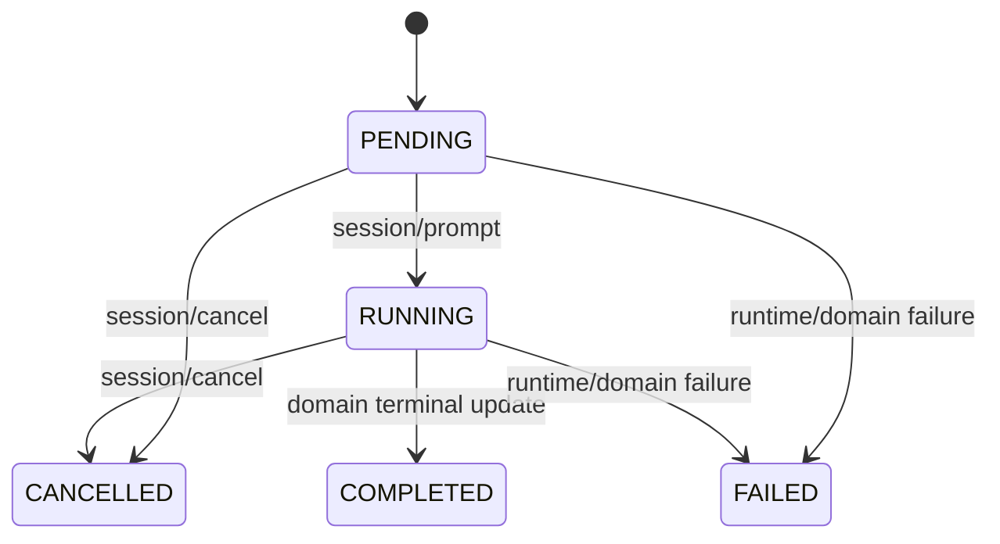

# ACP MVP (Team AI)

本文档描述 Team AI 当前 ACP MVP 的协议、状态机、错误码和调试方式。

## 1. Endpoint

- JSON-RPC: `POST /api/acp`
- SSE Stream: `GET /api/acp?sessionId={id}`
  - 支持 `Last-Event-ID` 请求头用于增量拉取事件。

## 2. JSON-RPC Contract

所有请求均使用 JSON-RPC 2.0:

```json
{
  "jsonrpc": "2.0",
  "method": "session/new",
  "params": {},
  "id": "req-1"
}
```

统一响应:

```json
{
  "jsonrpc": "2.0",
  "id": "req-1",
  "result": {},
  "error": null
}
```

失败响应:

```json
{
  "jsonrpc": "2.0",
  "id": "req-1",
  "result": null,
  "error": {
    "code": -32004,
    "message": "sessionId not found: 999",
    "meta": {
      "acpCode": "ACP_SESSION_NOT_FOUND",
      "httpStatus": 404,
      "retryable": false
    }
  }
}
```

## 3. Methods

### 3.1 initialize

返回 server/capabilities/methods。

### 3.2 session/new

最小参数:

- `projectId` (string)
- `actorUserId` (string)

可选参数:

- `provider` (default: `team-ai`)
- `mode` (default: `CHAT`)
- `goal`

行为:

- 创建 ACP 会话（PENDING）
- 启动运行时 session（AgentRuntime.start）

### 3.3 session/prompt

参数:

- `projectId`
- `sessionId`
- `prompt`
- `timeoutMs` (可选，毫秒)
- `eventId` (可选)

行为:

- PENDING -> RUNNING
- 触发 `AgentRuntime.send`
- 输出 runtime 结果与事件（delta/complete）

### 3.4 session/cancel

参数:

- `projectId`
- `sessionId`
- `reason` (可选)

行为:

- 会话置为 `CANCELLED`
- 调用 `AgentRuntime.stop`
- 写入 complete 事件

### 3.5 session/load

参数:

- `projectId`
- `sessionId`

行为:

- 返回会话快照

## 4. SSE Event Envelope

SSE 事件名固定为 `acp-event`，payload 为 JSON envelope:

```json
{
  "eventId": "acp-401-status-12",
  "sessionId": "401",
  "type": "status",
  "emittedAt": "2026-03-03T06:30:00Z",
  "data": {
    "state": "CONNECTED",
    "traceId": "trace-acp-1"
  },
  "error": null
}
```

`type` 取值:

- `status`
- `delta`
- `complete`
- `error`

事件 ID 策略:

- `acp-{sessionId}-{type}-{sequence}`

## 5. Session State Machine



说明:

- 当前 MVP 的 `session/prompt` 默认保持会话可继续交互（RUNNING），并在事件层输出 `complete` 表示本次 prompt 完成。

## 6. Error Code Mapping

| ACP Code | JSON-RPC Code | HTTP Semantic | Retryable | Meaning |
| --- | --- | --- | --- | --- |
| `ACP_INVALID_REQUEST` | `-32600` | 400 | false | 协议包格式不合法 |
| `ACP_METHOD_NOT_FOUND` | `-32601` | 404 | false | method 不存在 |
| `ACP_INVALID_PARAMS` | `-32602` | 400 | false | 参数缺失/类型错误 |
| `ACP_FORBIDDEN` | `-32003` | 403 | false | 鉴权或项目成员校验失败 |
| `ACP_SESSION_NOT_FOUND` | `-32004` | 404 | false | session 不存在 |
| `ACP_PROJECT_NOT_FOUND` | `-32040` | 404 | false | project 不存在 |
| `ACP_RUNTIME_FAILED` | `-32050` | 502 | true | runtime 执行失败 |
| `ACP_RUNTIME_TIMEOUT` | `-32060` | 504 | true | runtime 超时 |
| `ACP_INTERNAL` | `-32603` | 500 | true | 未分类内部异常 |

## 7. Trace & Access Control

- `X-Trace-Id`:
  - 请求可携带；响应头会回传。
  - JSON-RPC `result.traceId` 与 SSE `data.traceId` 可用于端到端关联。
- 会话级访问控制:
  - 已认证用户下，`actorUserId` 必须与认证主体一致，且为项目成员。

## 8. curl Examples

### initialize

```bash
curl -s -X POST http://localhost:8080/api/acp \
  -H 'Content-Type: application/json' \
  -H 'X-Trace-Id: trace-init-1' \
  -d '{
    "jsonrpc":"2.0",
    "method":"initialize",
    "params":{},
    "id":"init-1"
  }' | jq
```

### session/new

```bash
curl -s -X POST http://localhost:8080/api/acp \
  -H 'Content-Type: application/json' \
  -d '{
    "jsonrpc":"2.0",
    "method":"session/new",
    "params":{
      "projectId":"1",
      "actorUserId":"1",
      "provider":"team-ai",
      "mode":"CHAT"
    },
    "id":"new-1"
  }' | jq
```

### session/prompt

```bash
curl -s -X POST http://localhost:8080/api/acp \
  -H 'Content-Type: application/json' \
  -d '{
    "jsonrpc":"2.0",
    "method":"session/prompt",
    "params":{
      "projectId":"1",
      "sessionId":"101",
      "prompt":"Summarize current backlog",
      "timeoutMs":30000
    },
    "id":"prompt-1"
  }' | jq
```

### session/cancel

```bash
curl -s -X POST http://localhost:8080/api/acp \
  -H 'Content-Type: application/json' \
  -d '{
    "jsonrpc":"2.0",
    "method":"session/cancel",
    "params":{
      "projectId":"1",
      "sessionId":"101",
      "reason":"cancelled from curl"
    },
    "id":"cancel-1"
  }' | jq
```

### SSE stream

```bash
curl -N http://localhost:8080/api/acp?sessionId=101
```

## 9. Web Debug Page

已提供前端最小验证页:

- 路径: `/acp-debug`
- 能力:
  - 新建会话
  - 加载会话
  - 发送 prompt
  - 取消会话
  - 连接/断开 SSE
  - 查看 RPC 响应与事件 envelope
