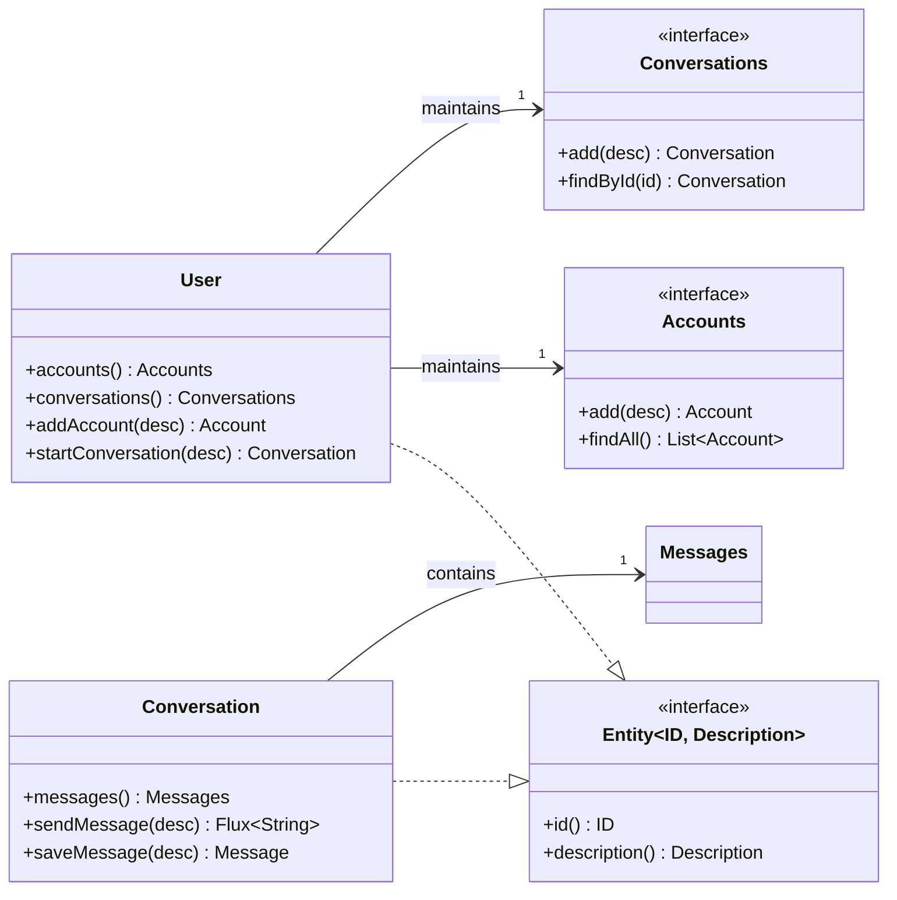

# Smart Domain DDD Architecture

This project demonstrates **Domain-Driven Design (DDD)** and **HATEOAS RESTful API** implementation using the **Smart Domain** pattern.

The core objective of this architecture is to **drive business logic and RESTful HATEOAS interfaces directly through highly cohesive domain models**, demonstrating how to solve performance bottlenecks and logic fragmentation issues in traditional architectures while providing extensible, type-safe API design patterns.

## Recommended Reading Order

To better understand the Smart Domain DDD architecture, we recommend reading the documentation in the following order:

1. **This Document** - Complete architecture design documentation to understand core design concepts
2. [REST Principles and Agentic UI](https://github.com/jayclock/team-ai/blob/main/public/REST_Principles_Agentic_UI.pdf) - Detailed explanation of REST architecture principles and Agentic UI design
3. [HATEOAS Client Implementation](https://github.com/jayclock/team-ai/blob/main/packages/resource/README.md) - TypeScript/JavaScript client library documentation


---

## 1. Domain Model Design Example

This example builds around **User** as the core business model, demonstrating the implementation of the Smart Domain pattern. Users primarily engage in two types of activities in the system: managing account configurations (Accounts) and conducting conversations (Conversations).

Core entity relationships:

- **User**: Aggregate root, the entry point and identity of the system.
- **Account**: User's configuration and account information (e.g., API Key management).
- **Conversation**: The conversation context initiated by the user, serving as a business logic carrier.
- **Message**: Specific interaction records within conversations.

---

## 2. Smart Domain Architecture Pattern

We adopt the "Association Object" pattern to solve the most challenging problem in Domain-Driven Design (DDD) implementation: how to solve underlying database performance limitations while maintaining model purity.

### 2.1 Core Conflict: Bridging "Performance" and "Model"

In multi-tier architectures, in-memory object collections are no longer equivalent to the database. Traditional approaches often face a dilemma:

1. **Model Purity**: If `User` directly holds `List<Conversation>`, the semantics are clearest, but loading a user requires reading thousands of conversations at once, causing Out of Memory (OOM).

2. **Performance Reality**: If simple lazy loading is used, traversal triggers the **N+1 problem** (1 query for overview, N queries for details), causing I/O blocking.

### 2.2 Solution: Association Object

To break this deadlock, we explicitly model "one-to-many relationships" as **Association Objects** rather than using built-in language `List`.

#### 2.2.1 Implementation Isolation and On-Demand Loading

Association Objects serve as bridges between the domain layer and infrastructure layer:

- **Explicit Modeling**: `User` depends on the `User.Conversations` interface, which is a first-class citizen, not a simple collection.

- **On-Demand Loading**: Calling `user.conversations()` only returns the association object itself (lightweight pointer) without triggering I/O. Only when calling specific behaviors (like `findAll(page)`) does the infrastructure layer execute optimized SQL.

#### 2.2.2 Collective Logic and Intention Revealing

Association Objects are the best place to store **Collective Logic**. Collective logic refers to capabilities that belong to "groups" rather than "individuals" (e.g., calculating the total token consumption of a group of conversations).

By encapsulating logic in association objects, we avoid logic leaking into the Service layer and achieve **Intention-Revealing Interfaces**.

**Comparison Example: Calculate User's Monthly Token Consumption**

❌ **Traditional Anemic Model (Service Script)**

- _Implicit Intent_: Only loops are visible, business purpose is not clear.
- _Performance Killer_: Pulls all data into memory for calculation, causing severe memory waste.

```java
// Logic leaks into Service layer
List<Conversation> all = user.getConversations(); // OOM risk!
int total = 0;
for (Conversation c : all) {
    if (c.isActiveThisMonth()) {
        total += c.getTokenUsage();
    }
}
```

✅ **Smart Domain (Association Object)**

- _Intention Revealing_: Method name directly states "I want to calculate consumption".
- _Performance Optimized_: Underlying automatically converts to `SELECT SUM(tokens) WHERE date > ?`.

```java
// Domain layer interface: Clearly expresses business intent
public interface Conversations extends HasMany<String, Conversation> {
    // [Intention Revealing]: Not just "get", but "calculate consumption"
    TokenUsage calculateConsumption(TimeRange range);

    // [Intention Revealing]: Find the most recent active session for context recovery
    Optional<Conversation> findLatestActiveSession();

    // [Intention Revealing]: Archive old data
    void archiveStaleConversations(int daysOlder);
}

// Caller (Domain Service or Application Service)
user.conversations().calculateConsumption(TimeRange.thisMonth());
```

### 2.3 Implementation Strategy: Wide vs. Narrow Interface Separation

To ensure business logic encapsulation, we adopt a strategy of separating **Wide Interface (internal implementation)** from **Narrow Interface (external exposure)**. This ensures that domain entities (like `User`) can only modify state through controlled domain behaviors, while query operations are exposed through safe read-only interfaces.



**Java Code Implementation Example:**

```java
public class User implements Entity<String, UserDescription> {
    private Accounts accounts; // Association object

    // 1. Expose Narrow Interface:
    // Only expose read-only or restricted collection operations externally, prohibit direct add/remove
    public HasMany<String, Account> accounts() {
        return accounts;
    }

    // 2. Expose Domain Behavior:
    // State modification must go through semantic methods on the entity
    public Account add(AccountDescription description) {
        return accounts.add(description);
    }

    // 3. Internal Wide Interface:
    // Define the complete contract that the persistence layer must implement, including underlying operations like add
    public interface Accounts extends HasMany<String, Account> {
        Account add(AccountDescription description);
    }
}
```

---

## 3. Structured Query of Domain Model

This architecture demonstrates how to expose Smart Domain as a programmable **Domain Object Model (DOM)**, supporting exploration through deterministic query languages.

### 3.1 Core Philosophy: Query > Search

In complex business scenarios, **Query is superior to Search**.

- **Search (Traditional Way)**: Probabilistic. Relies on fuzzy matching to find "possibly relevant" fragments, prone to omissions.

- **Query (Smart Domain)**: Deterministic. "Precisely locates" information within a known structure, operating the domain model like a database.

We use **Association Objects** to build the system's "directory tree", transforming clients from passive consumers receiving all data into active **Researchers** who can first look at the directory, then check definitions, and finally read detailed content.

### 3.2 Domain DOM and Structured Navigation

Modern clients show good stability when handling JSON structures. Therefore, we can adopt **JSONPath-like** syntax as the **DSL (Domain Specific Language)** for client-backend interaction.

We map the `User` aggregate root and its association objects to a virtual domain object tree, allowing clients to access properties and filter through the `$` root node.

**Domain DOM Structure Example (JSON View):**

```json
{
  "$schema": "http://team-ai.dev/schema/domain-dom",
  "user": {
    "identity": "user_123",
    "conversations": {
      "type": "AssociationObject",
      "semantics": "User conversation collection",
      "_items": [
        /* Lazy Loaded */
      ]
    },
    "accounts": {
      "type": "AssociationObject",
      "semantics": "Configuration and API Keys"
    }
  }
}
```

### 3.3 Client Query Workflow Example

When clients need to obtain specific information, they no longer perform fuzzy searches but execute multi-level path operations similar to an **engineer finding materials**:

**Scenario Case:** Client needs to find "conversations about a specific topic from last week and analyze content".

**Step 1: Top-Level Overview (Level 1 Navigation)**

Client first looks at the root directory to confirm entry point.

- **Query Instruction**: `$.user.conversations`

- **System Returns**: Association object metadata (including `findAll` capability description), not full data.

**Step 2: Structured Filtering (Level 2 Filtering)**

Client uses JSONPath-like syntax to issue precise filtering instructions, which directly maps to underlying SQL `WHERE` clauses, avoiding memory loading of irrelevant conversations.

- **Query Instruction**:

```javascript
// Find conversations updated in the last 7 days with titles containing specific keywords
$.user.conversations[?(@.updated_at >= 'now-7d' && @.title =~ /Keyword/)]
```

- **System Returns**: List of `Conversation` entities matching criteria (lightweight summary).

**Step 3: Entity Drill-down (Level 3 Drill-down)**

Client locks on target ID to get specific message content.

- **Query Instruction**: `$.user.conversations['conv_99'].messages`

- **System Returns**: Specific message record list.

---

## 4. Domain-Driven RESTful HATEOAS

We believe: **API hypermedia links (Links) are the direct projection of the domain model's cognitive map on the HTTP protocol.**

### 4.1 Isomorphism

The relationship between Entity and Association Object naturally corresponds to the relationship between REST resources and sub-resources. We leverage this isomorphism to achieve Richardson Maturity Model Level 3 at zero cost.

| **Domain Model (Java Domain)** | **Semantics**                     | **RESTful API (HTTP Resource)**   | **HATEOAS Link Relation** |
| ------------------------------ | --------------------------------- | --------------------------------- | ------------------------- |
| `user.conversations()`         | Get user's conversation entry     | `GET /users/{1}/conversations`    | `rel="conversations"`     |
| `user.accounts()`              | Get user's account configuration  | `GET /users/{1}/accounts`         | `rel="accounts"`          |
| `conversation.messages()`      | Get conversation's message stream | `GET /conversations/{1}/messages` | `rel="messages"`          |

### 4.2 Zero-Copy and Wrapper Pattern

We don't use DTOs for data copying, but use the **Wrapper** pattern instead. `UserModel` is a view adapter holding entity references that dynamically generates links based on entity relationships.

```java
public class UserModel extends RepresentationModel {
    private final User user; // Hold reference, zero-copy

    public UserModel(User user, UriInfo info) {
        this.user = user;
        // Dynamically generate Self Link
        this.addLink("self", ApiTemplates.user(info).build(user.getIdentity()));

        // Structure is navigation: Because User has conversations(), API must have corresponding Link
        this.addLink("conversations", ApiTemplates.conversations(info).build(user.getIdentity()));
    }
}
```

### 4.3 HATEOAS: "Progressive Disclosure" at the API Layer

In modern client development, **"Progressive Disclosure"** is the core mechanism for solving the conflict between complex functionality and limited interfaces. HATEOAS in RESTful architecture is the perfect implementation of this mechanism on the HTTP protocol layer.

#### 4.3.1 Mechanism Isomorphism Comparison


The Smart Domain architecture uses association objects to achieve progressive loading of data structures, which is highly consistent in design philosophy with the **Agent Skills** architecture used by modern AI Agents (like Claude Code).

Both essentially manage massive information in constrained environments through the **"Progressive Disclosure"** mechanism, but with different focuses:

- **Agent Skills (Progressive Indexing)**: Aims to solve the AI model's **Context Window** bottleneck. By building lightweight **Progressive Indexing**, AI can "sense" the existence of massive knowledge without actually "loading" it.

- **HATEOAS (Progressive Hypermedia)**: Aims to solve the client's **Bandwidth & Coupling** bottleneck. Through **Progressive Hypermedia**, clients can dynamically discover next available operations based on current state without hardcoding business processes.

| **Cognitive Stage**                       | **Agent Skills (AI Context)**                                                                                                                                                                                          | **RESTful HATEOAS (API Context)**                                                                                                                                                                                                                 | **Core Mechanism**                                                                          |
| ----------------------------------------- | ---------------------------------------------------------------------------------------------------------------------------------------------------------------------------------------------------------------------- | ------------------------------------------------------------------------------------------------------------------------------------------------------------------------------------------------------------------------------------------------- | ------------------------------------------------------------------------------------------- |
| **L1: Discovery**<br><br>_Building Index_ | **Progressive Indexing**:<br><br>AI only scans YAML header's `name` and `description` at startup, building lightweight "capability pointers" in system prompts. **No Token consumption** for reading specific content. | **Hypermedia Navigation**:<br><br>Client parses the entry resource's `_links` collection, building navigation map for current context. Client only knows "this function exists" but **doesn't preload data**.                                     | **Lightweight Index**:<br><br>Only holds metadata or links, building "capability map".      |
| **L2: Decision**<br><br>_Intent Matching_ | **Semantic Intent Matching**:<br><br>AI finds description-matching Skills in the index based on user task's natural language (like "help me review code"), deciding whether to activate that skill.                    | **Hypermedia Function Discovery**:<br><br>Client queries if a specific `rel` link exists (like `rel="edit"`). If link doesn't exist (dynamically pruned by backend), interface disables corresponding button. **No extra logic judgment needed**. | **Intent Driven**:<br><br>Make decisions based on description (AI) or link existence (API). |
| **L3: Loading**<br><br>_Execute Fetch_    | **JIT Context Injection**:<br><br>Only after successful matching does AI read `SKILL.md` content or execute script. At this point, specific domain knowledge is **on-demand** loaded into context window.              | **State Transfer**:<br><br>Only when user clicks operation does client issue `GET` request to `href`, obtaining complete resource Representation. **Network bandwidth** is consumed at this point.                                                | **Just-In-Time Loading**:<br><br>Defer high-cost operations until truly needed.             |
| **Optimization Goal**                     | **Maximize Token Utilization**                                                                                                                                                                                         | **Minimize Bandwidth Consumption & Logic Coupling**                                                                                                                                                                                               | **Resource Efficiency**                                                                     |

#### 4.3.2 Evolution Path: Transformation Mapping from HATEOAS to Agent Skills

A core advantage of this architecture is: **Once HATEOAS is implemented, 80% of Agent Skills definition is complete.** Because HATEOAS has standardized resources (nouns) and link relations (verbs), we can map them to AI skill descriptions through deterministic rules.

This transformation is based on the following **Semantic Anchors** correspondence:

| **HATEOAS Element (API)** | **Semantic Role**                              | **Agent Skill Mapping (AI)** | **Transformation Logic**                                                                    |
| ------------------------- | ---------------------------------------------- | ---------------------------- | ------------------------------------------------------------------------------------------- |
| **Relation (`rel`)**      | Define business relationship between resources | **Skill Keywords**           | `rel="conversations"` directly maps to keyword "Manage conversations" in Skill description. |
| **Href (`_links`)**       | Define operation entry address                 | **Tool Definition**          | API path becomes the specific tool or API Client endpoint callable by Skill.                |
| **HTTP Method**           | Define operation nature (read/write)           | **Action Type**              | `GET` maps to "query/read" instruction; `POST` maps to "create/execute" instruction.        |
| **Root Resource**         | API's top-level entry                          | **Skill Description**        | API's root directory documentation directly converts to `description` field in `SKILL.md`.  |

**Transformation Example: Auto-Generate Skill Definition**

Smart Domain allows us to write converters that automatically generate `SKILL.md` based on API's HATEOAS response.

**1. Input: HATEOAS API Response (User Resource)**

```json
// GET /users/123
{
  "identity": "user_123",
  "_links": {
    "self": { "href": "/users/123" },
    "conversations": {
      "href": "/users/123/conversations",
      "title": "User conversation history management"
    },
    "accounts": {
      "href": "/users/123/accounts",
      "title": "API Key and configuration"
    }
  }
}
```

**2. Output: Generated Agent Skill (SKILL.md)**

```yaml
---
name: user-manager-skill
description: >
  A skill for managing User "user_123".
  Capabilities include:
  1. "conversations" (User conversation history management)
  2. "accounts" (API Key and configuration).
  Use this skill when the user wants to check history or change settings.
---

# User Manager Skill

## Available Actions (Derived from HATEOAS Links)

1. **Manage Conversations**
   - **Trigger**: When asked about chat history or sessions.
   - **Tool**: `GET /users/123/conversations`

2. **Manage Accounts**
   - **Trigger**: When asked about configuration or keys.
   - **Tool**: `GET /users/123/accounts`
```

Through this mapping, we achieve **"Define Once, Consume Everywhere"**:

1. **Web Client**: Renders UI through HATEOAS.

2. **AI Agent**: Understands and operates business through generated Skills.

## 4.4 Evolution Path: From HATEOAS to A2UI (Agentic UI)

If **Agent Skills** is the mapping of HATEOAS at the AI **logical cognition layer**, then **A2UI (Agent to UI)** is the direct projection of HATEOAS at the **visual interaction layer**.

Through Google's open-source **A2UI** standard, we can automatically convert HATEOAS resource states to declarative JSON UI descriptions, achieving **"Server-Driven Agentic UI"**.

### 4.4.1 Core Philosophy: UI as State Projection

Under the A2UI system, frontend no longer hardcodes interface components but acts as a pure **Renderer**. Backend Smart Domain model tells Client through HATEOAS response: "What you can do in current state", along with corresponding UI descriptions.

| **HATEOAS Element (Backend)**               | **Transformation Logic**                | **A2UI Component (Frontend)** | **Interaction Semantics**          |
| ------------------------------------------- | --------------------------------------- | ----------------------------- | ---------------------------------- |
| **Resource State**<br>`{"balance": 100}`    | Data Binding -> Display Component       | `Text`, `Table`, `Status`     | **Read**: Information user sees    |
| **Form Property**<br>`"date": "2025-12-20"` | Type Inference -> Input Component       | `DateTimeInput`, `TextInput`  | **Write**: Parameters user fills   |
| **Link (`_links`)**<br>`rel="submit"`       | Behavior Mapping -> Trigger Component   | `Button`, `Fab`               | **Execute**: Actions user triggers |
| **Error/Exception**                         | Exception Mapping -> Feedback Component | `Banner`, `Toast`             | **Feedback**: System feedback      |

### 4.4.2 Architecture Diagram: Dual-State Mapping

Smart Domain supports both "human-machine interaction" and "machine-machine interaction" through a lightweight adapter layer.

```mermaid
flowchart LR
    subgraph Domain ["Smart Domain Core"]
        Entity[Domain Entity] -->|State| HATEOAS[HATEOAS Resource]
    end

    subgraph Adapters ["Presentation Adapters"]
        HATEOAS -->|Mapping 1: Semantic Extraction| Skill[Agent Skill (YAML)]
        HATEOAS -->|Mapping 2: Visual Declaration| A2UI[A2UI JSON]
    end

    subgraph Clients ["Consumers"]
        Skill -->|Reasoning| AI_Agent[AI Agent Logic]
        A2UI -->|Rendering| App_UI[Native Client / Web]
    end

    AI_Agent -.->|Action| HATEOAS
    App_UI -.->|Action| HATEOAS
```

### 4.4.3 Code Example: HATEOAS to A2UI Mapping for Complex Forms

**Scenario**: User requests to configure a new AI conversation agent (Agent Persona). The form needs to include basic information, model parameter configuration (enums and numbers), and lifecycle settings.

1. HATEOAS Source Data (Backend Source)

Backend returns resources containing \_templates (similar to HAL-FORMS), precisely defining field constraints, types, and default values, while defining multiple available operations through \_links.

```json
// GET /agents/new-configuration
{
  "title": "Configure New Agent",
  "defaults": {
    "temperature": 0.7,
    "model": "gpt-4o"
  },
  "_links": {
    "self": { "href": "/agents/new-configuration" },
    "create": {
      "href": "/agents",
      "method": "POST",
      "title": "Create Now"
    },
    "save-draft": {
      "href": "/agents/drafts",
      "method": "POST",
      "title": "Save Draft"
    }
  },
  "_templates": {
    "default": {
      "properties": [
        {
          "name": "name",
          "type": "text",
          "required": true,
          "label": "Agent Name"
        },
        {
          "name": "systemPrompt",
          "type": "textarea",
          "label": "System Prompt"
        },
        {
          "name": "model",
          "type": "select",
          "label": "Base Model",
          "options": [
            { "label": "GPT-4o (High Intelligence)", "value": "gpt-4o" },
            { "label": "Claude 3.5 Sonnet (Coding)", "value": "claude-3-5" },
            { "label": "Gemini Pro (Balanced)", "value": "gemini-pro" }
          ]
        },
        {
          "name": "expiryDate",
          "type": "datetime",
          "label": "Auto-Archive Time"
        }
      ]
    }
  }
}
```

2. A2UI Transformation Result (Frontend A2UI JSON)

The Adapter converts the flat HATEOAS template above into an A2UI tree with **Layout Hierarchy**. Note how it groups fields into different Containers and selects SelectionInput or DateTimeInput based on field type.

```json
{
  "surfaceUpdate": {
    "surfaceId": "agent-config-panel",
    "components": [
      {
        "id": "header-title",
        "component": {
          "Text": { "text": { "literalString": "Configure New Agent" }, "usageHint": "h2" }
        }
      },
      // --- Section 1: Basic Information Area ---
      {
        "id": "section-basic",
        "component": {
          "Container": {
            "direction": "column",
            "children": [
              {
                "id": "inp-name",
                "component": {
                  "TextInput": {
                    "label": { "literalString": "Agent Name *" },
                    "value": { "path": "/request/name" }
                  }
                }
              },
              {
                "id": "inp-prompt",
                "component": {
                  "TextInput": {
                    "label": { "literalString": "System Prompt" },
                    "value": { "path": "/request/systemPrompt" },
                    "multiline": true,
                    "minLines": 3
                  }
                }
              }
            ]
          }
        }
      },
      // --- Section 2: Advanced Configuration Area (Dropdown and Date) ---
      {
        "id": "section-advanced",
        "component": {
          "Container": {
            "style": "card",
            "children": [
              {
                "id": "inp-model",
                "component": {
                  "SelectionInput": {
                    "label": { "literalString": "Base Model" },
                    "type": "dropdown",
                    "value": { "path": "/request/model" },
                    "options": [
                      { "label": "GPT-4o (High Intelligence)", "value": "gpt-4o" },
                      { "label": "Claude 3.5 Sonnet (Coding)", "value": "claude-3-5" },
                      { "label": "Gemini Pro (Balanced)", "value": "gemini-pro" }
                    ]
                  }
                }
              },
              {
                "id": "inp-date",
                "component": {
                  "DateTimeInput": {
                    "label": { "literalString": "Auto-Archive Time" },
                    "value": { "path": "/request/expiryDate" },
                    "enableDate": true,
                    "enableTime": true
                  }
                }
              }
            ]
          }
        }
      },
      // --- Footer: Action Button Group ---
      {
        "id": "action-bar",
        "component": {
          "Container": {
            "direction": "row",
            "justifyContent": "end",
            "children": [
              {
                "id": "btn-draft",
                "component": {
                  "Button": {
                    "style": "outlined",
                    "child": "txt-draft",
                    "action": { "name": "save-draft", "parameters": { "href": "/agents/drafts" } }
                  }
                }
              },
              {
                "id": "btn-submit",
                "component": {
                  "Button": {
                    "style": "filled",
                    "child": "txt-submit",
                    "action": { "name": "create", "parameters": { "href": "/agents" } }
                  }
                }
              }
            ]
          }
        }
      }
    ]
  }
}
```

### 4.4.4 Value: Dynamically Generated Enterprise-Grade Interfaces

After introducing A2UI, our architecture gains the following capabilities:

1. **Zero Frontend Code**: Adding new form fields or business processes only requires modifying backend HATEOAS definitions; frontend A2UI renderer automatically updates the interface.

2. **Secure Native Rendering**: UI is not composed of uncontrollable HTML string concatenation but driven by JSON instructions to native client components (Web Components or Native Views), avoiding XSS attacks and ensuring enterprise-grade consistency.

3. **Multi-Platform Consistency**: The same HATEOAS -> A2UI logic can simultaneously drive Web, iOS, and Android clients without separate UI development for each platform.

---

## 5. Summary

The Smart Domain DDD architecture of this project is not just a code implementation pattern, but a backend design philosophy oriented toward the future. Through **Smart Domain Model** and **Association Object** technology, it achieves the following core values:

1. **Bridging the Performance Gap**: Using association objects as buffers between domain and infrastructure layers, thoroughly solving N+1 problems and large object loading memory risks while maintaining model semantic purity.

2. **Building Semantic Barriers**: Through **Wide-Narrow Interface Separation** and **Intention Revealing** design, strictly encapsulating business logic in the domain core, preventing logic leakage to the Service layer, ensuring long-term system maintainability.

3. **Achieving Cognitive Isomorphism**: Innovatively establishing bidirectional mapping between **RESTful HATEOAS** and **AI Agent Skills**. Proving that APIs conforming to Richardson Maturity Model Level 3 are naturally skill sets that AI Agents can understand and operate.

4. **Unifying Architecture Paradigm**: Based on "Progressive Disclosure" mechanism, building a universal "Define Once, Consume Everywhere" protocol, enabling backend to efficiently support both Web interface interaction and AI automated agents.
