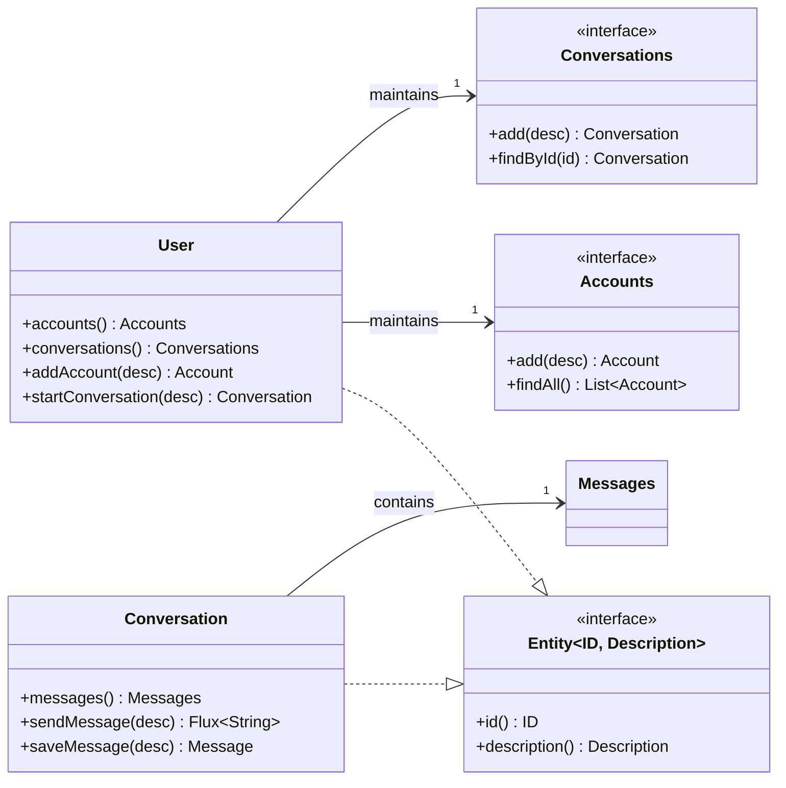

# Smart Domain DDD 架构实现

本项目是一个使用 **Smart Domain (智能领域模型)** 模式实现**领域驱动设计 (DDD)** 和 **HATEOAS RESTful API** 的代码样例。

本架构的核心目标是：**通过高内聚的领域模型直接驱动业务逻辑和 RESTful HATEOAS 接口**，展示如何解决传统架构中的性能瓶颈与逻辑分散问题，同时提供可扩展的、类型安全的 API 设计模式。

---

## 1. 领域模型设计示例

本示例围绕 **User (用户)** 构建核心业务模型，展示 Smart Domain 模式的实现。用户在系统中主要进行两类活动：管理账户配置（Accounts）和进行对话（Conversations）。

核心实体关系如下：

* **User**: 聚合根，系统的入口与身份标识。
* **Account**: 用户的配置与账户信息（如 API Key 管理）。
* **Conversation**: 用户发起的对话上下文，作为业务逻辑载体。
* **Message**: 对话中的具体交互记录。

---

## 2. Smart Domain 架构模式

我们采用了“关联对象（Association Object）”模式来解决领域驱动设计（DDD）落地中最棘手的难题：如何在保持模型纯净性的同时，解决底层数据库的性能限制。

### 2.1 核心冲突：跨越“性能”与“模型”的障碍

在多层架构中，内存中的对象集合与数据库不再等价。传统做法往往陷入两难：

1. **模型纯洁性 (Model Purity)**：如果在 `User` 中直接持有 `List<Conversation>`，语义最清晰，但在加载用户时必须一次性读入成千上万条对话，导致内存溢出（OOM）。
2. **性能现实 (Performance Reality)**：如果采用简单的懒加载，遍历时会触发 **N+1 问题**（1次查询概况，N次查询明细），导致 I/O 阻塞。

### 2.2 解决方案：关联对象 (Association Object)

为了打破僵局，我们将“一对多关系”显式建模为 **关联对象**，而非使用语言内置的 `List`。

#### 2.2.1 隔离实现与按需加载

关联对象充当了领域层与基础设施层之间的桥梁：

* **显式建模**：`User` 依赖于 `Conversations` 接口，这是一等公民，而非简单的集合。
* **按需加载**：调用 `user.conversations()` 仅返回关联对象本身（轻量级指针），不触发 I/O。只有调用具体行为（如 `findAll(page)`）时，基础设施层才会执行优化后的 SQL。

#### 2.2.2 集体逻辑与意图揭示 (Collective Logic & Intention Revealing)

关联对象是存放 **集体逻辑** 的最佳场所。所谓集体逻辑，是指那些属于“群体”而不属于“个体”的能力（例如：计算一群对话的总 Token 消耗）。

通过将逻辑封装在关联对象中，我们避免了逻辑泄露到 Service 层，并实现了**揭示意图的接口**。

**对比示例：计算用户本月 Token 消耗**

* ❌ **传统贫血模型 (Service 脚本)**
* *隐式意图*：只能看到循环，看不出业务目的。
* *性能杀手*：将所有数据拉到内存计算，造成严重的内存浪费。


```java
// 逻辑泄露在 Service 层
List<Conversation> all = user.getConversations(); // OOM 风险！
int total = 0;
for (Conversation c : all) {
    if (c.isActiveThisMonth()) {
        total += c.getTokenUsage();
    }
}

```


* ✅ **Smart Domain (关联对象)**
* *意图揭示*：方法名直接说明“我要统计消耗”。
* *性能优化*：底层自动转化为 `SELECT SUM(tokens) WHERE date > ?`。


```java
// 领域层接口：清晰表达业务意图
public interface Conversations extends HasMany<String, Conversation> {
    // [意图揭示]：不仅是“获取”，而是“统计消耗”
    TokenUsage calculateConsumption(TimeRange range);

    // [意图揭示]：寻找最近的活跃会话，用于上下文恢复
    Optional<Conversation> findLatestActiveSession();

    // [意图揭示]：归档旧数据
    void archiveStaleConversations(int daysOlder);
}

// 调用端 (Domain Service 或 Application Service)
user.conversations().calculateConsumption(TimeRange.thisMonth());

```


### 2.3 实现策略：宽窄接口分离 (Wide vs. Narrow Interface)

为了确保业务逻辑的封装性，我们采用了**宽接口（内部实现）**与**窄接口（对外暴露）**分离的策略。这确保了领域实体（如 `User`）只能通过受控的领域行为修改状态，而查询操作则通过安全的只读接口暴露。



**Java 代码实现示例：**

```java
public class User implements Entity<String, UserDescription> {
    private Accounts accounts; // 关联对象

    // 1. 暴露窄接口 (Narrow Interface)：
    // 对外只暴露只读或受限制的集合操作，禁止外部直接 add/remove
    public HasMany<String, Account> accounts() {
        return accounts;
    }

    // 2. 暴露领域行为 (Domain Behavior)：
    // 修改状态必须通过实体上的语义化方法
    public Account add(AccountDescription description) {
        return accounts.add(description);
    }

    // 3. 内部宽接口 (Wide Interface)：
    // 定义持久化层必须实现的完整契约，包含 add 等底层操作
    public interface Accounts extends HasMany<String, Account> {
        Account add(AccountDescription description);
    }
}

```

---

## 3. 领域模型的结构化查询

本架构展示了如何将 Smart Domain 暴露为一个可编程的 **领域对象模型 (Domain Object Model, DOM)**，支持确定性的查询语言进行探索。

### 3.1 核心哲学：Query > Search

在复杂业务场景中，**Query（查询）优于 Search（搜索）**。

* **Search (传统方式)**：概率性的（Probabilistic）。依赖模糊匹配寻找"可能相关"的片段，容易产生遗漏。
* **Query (Smart Domain)**：确定性的（Deterministic）。在已知结构中"精确定位"信息，像操作数据库一样操作领域模型。

我们利用 **关联对象** 构建了系统的"目录树"，客户端不再是被动接收全部数据的消费者，而是变成了一个能够主动探索的 **研究员 (Researcher)**，它能够先看目录，再查定义，最后读详细内容。

### 3.2 领域 DOM 与结构化导航

现代客户端在处理 JSON 结构时表现出良好的稳定性。因此，我们可以采用 **类 JSONPath (JSONPath-like)** 语法作为客户端与后端交互的 **DSL (领域特定语言)**。

我们将 `User` 聚合根及其关联对象映射为一棵虚拟的领域对象树，客户端可以通过 `$` 根节点进行属性访问和过滤。

**领域 DOM 结构示例 (JSON View):**

```json
{
  "$schema": "http://team-ai.dev/schema/domain-dom",
  "user": {
    "identity": "user_123",
    "conversations": {
      "type": "AssociationObject",
      "semantics": "用户对话集合",
      "_items": [ /* Lazy Loaded */ ]
    },
    "accounts": {
      "type": "AssociationObject",
      "semantics": "配置与API Key"
    }
  }
}

```

### 3.3 客户端查询工作流示例

当客户端需要获取特定信息时，它不再进行模糊搜索，而是执行类似 **工程师查找资料** 的多级路径操作：

**场景案例：** 客户端需要找到"上周关于特定主题的对话，并分析内容"。

**Step 1: 顶层概览 (Level 1 Navigation)**
客户端首先查看根目录，确认入口位置。

* **查询指令**: `$.user.conversations`
* **系统返回**: 关联对象的元数据（包含 `findAll` 能力描述），而非全量数据。

**Step 2: 结构化过滤 (Level 2 Filtering)**
客户端利用类 JSONPath 语法下发精准过滤指令，这直接映射到底层的 SQL `WHERE` 子句，避免了内存加载大量无关对话。

* **查询指令**:
```javascript
// 查找最近7天且标题包含特定关键词的对话
$.user.conversations[?(@.updated_at >= 'now-7d' && @.title =~ /Keyword/)]

```


* **系统返回**: 符合条件的 `Conversation` 实体列表（轻量级摘要）。

**Step 3: 实体深钻 (Level 3 Drill-down)**
客户端锁定目标 ID，获取具体的消息内容。

* **查询指令**: `$.user.conversations['conv_99'].messages`
* **系统返回**: 具体的消息记录列表。

---

## 4. 领域驱动的 RESTful HATEOAS

我们认为：**API 的超媒体链接（Links）是领域模型认知地图在 HTTP 协议上的直接投影。**

### 4.1 同构映射 (Isomorphism)

实体（Entity）与关联对象（Association Object）的关系，天然对应 REST 资源与子资源的关系。我们利用这种同构性，零成本实现了 Richardson 成熟度模型第 3 级。

| 领域模型 (Java Domain) | 语义 (Semantics) | RESTful API (HTTP Resource) | HATEOAS Link Relation |
| --- | --- | --- | --- |
| `user.conversations()` | 获取该用户的对话入口 | `GET /users/{1}/conversations` | `rel="conversations"` |
| `user.accounts()` | 获取该用户的账户配置 | `GET /users/{1}/accounts` | `rel="accounts"` |
| `conversation.messages()` | 获取该对话的消息流 | `GET /conversations/{1}/messages` | `rel="messages"` |

### 4.2 零拷贝与 Wrapper 模式

我们不使用 DTO 进行数据拷贝，而是使用 **Wrapper（包装器）** 模式。`UserModel` 是一个持有实体引用的视图适配器，它根据实体的关联关系动态生成链接。

```java
public class UserModel extends RepresentationModel {
    private final User user; // 持有引用，零拷贝

    public UserModel(User user, UriInfo info) {
        this.user = user;
        // 动态生成 Self Link
        this.addLink("self", ApiTemplates.user(info).build(user.getIdentity()));
        
        // 结构即导航：因为 User 有 conversations()，所以 API 必须有对应的 Link
        this.addLink("conversations", ApiTemplates.conversations(info).build(user.getIdentity()));
    }
}

```

### 4.3 HATEOAS：API 层的"渐进式披露" (Progressive Disclosure)

在现代客户端开发中，**"渐进式披露"** 是解决复杂功能与有限界面之间矛盾的核心机制。RESTful 架构中的 HATEOAS 正是这一机制在 HTTP 协议层上的完美实现。

#### 4.3.1 机制同构性对比

Smart Domain 架构利用关联对象实现了数据结构的渐进式加载，而 HATEOAS 则实现了 **行为与能力的渐进式发现**。两者在设计理念上高度一致：

| 认知阶段 | 客户端发现 (本地/CLI) | RESTful HATEOAS (远程/API) | 目的 (Goal) |
| --- | --- | --- | --- |
| **L1: 发现 (Discovery)** | 扫描配置文件中的 `description` | 解析 JSON 中的 `_links` 和 `rel` (关系描述) | **轻量级索引**：仅占用极少资源，建立能力地图 |
| **L2: 决策 (Decision)** | 客户端根据描述判断是否匹配当前意图 | 客户端根据 `rel` (如 `next`, `edit`) 判断下一步行动 | **意图匹配**：无需加载全部数据，仅根据元数据决策 |
| **L3: 加载 (Loading)** | 触发功能模块，读取详细配置 | 执行 `GET` 请求，获取具体资源的 `State` | **按需加载 (JIT)**：只有被选中时，才消耗 I/O 和带宽 |

#### 4.3.2 为什么这对现代客户端至关重要？

在本项目的 HATEOAS 架构中，API 交互变成了一棵可以被客户端 **逐步遍历的决策树**，而非一本厚重的 API 文档：

1. **初始状态**：客户端访问 `/api/root`，只看到 User、System 等顶级入口的链接。
2. **按需展开**：只有当客户端决定"我要管理用户"时，它才会通过链接进入 `/users/{id}`，此时才"披露"出 `conversations` 或 `accounts` 的链接。
3. **动态剪枝**：如果用户没有权限创建对话，后端 `UserModel` 根本不会生成 `create-conversation` 的链接。客户端检测到链接缺失，就能推断出"当前无法创建对话"，从而避免无效尝试。

这种机制完美契合了 **现代客户端** 的设计哲学：**"提供丰富功能"与"保持界面简洁高效"的平衡**。

---

## 5. 总结

本项目的 Smart Domain DDD 架构展示了如何通过 **智能领域模型** 和 **关联对象** 技术，达成以下目标：

1. **解决 N+1 问题**：利用关联对象隔离领域逻辑与数据库实现，跨越性能与模型的障碍。
2. **保护业务逻辑封装**：通过 **宽接口与窄接口分离** 策略，确保领域模型的状态变更安全可控。
3. **意图揭示接口设计**：通过语义化方法名和接口设计，清晰表达业务意图。
4. **低成本 HATEOAS**：利用同构映射与"渐进式披露"机制，为客户端构建了一套高效的、可自我发现的 API 交互范式。

这个实现为开发者提供了一个完整的 Smart Domain DDD 架构参考，展示了如何在实际项目中应用这些设计模式和最佳实践。
