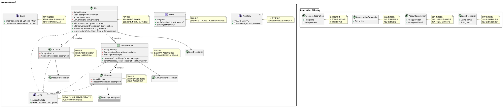

```plantuml
@startuml
package "Domain Model" {
    interface Entity<ID, Description> {
        +getIdentity(): ID
        +getDescription(): Description
    }
    note right: 实体接口，定义领域对象的基本行为\n包含身份标识和描述信息
    
    interface HasMany<ID, E> {
        +findAll(): Many<E>
        +findByIdentity(ID): Optional<E>
    }
    note right: 一对多关联接口\n提供查找和访问关联实体的方法
    
    interface Many<E> {
        +size(): int
        +subCollection(int, int): Many<E>
        +stream(): Stream<E>
    }
    note right: 集合接口\n表示多个实体的集合，支持分页和流式处理
    
    class User {
        -String identity
        -UserDescription description
        -Accounts accounts
        -Conversations conversations
        +add(AccountDescription): Account
        +add(ConversationDescription): Conversation
        +accounts(): HasMany<String, Account>
        +conversations(): HasMany<String, Conversation>
    }
    note right: 用户实体\n系统中的核心用户对象\n包含用户基本信息、账户和会话
    
    class Account {
        -String identity
        -AccountDescription description
    }
    note right: 账户实体\n表示用户的外部认证账户\n如 OAuth 提供商账户
    
    class Conversation {
        -String identity
        -ConversationDescription description
        -Messages messages
        +messages(): HasMany<String, Message>
        +sendMessage(MessageDescription): Flux<String>
    }
    note right: 会话实体\n表示用户与 AI 的对话会话\n包含多条消息和发送消息的功能
    
    class Message {
        -String identity
        -MessageDescription description
    }
    note right: 消息实体\n表示对话中的单条消息\n包含角色和内容信息
    
    interface Users {
        +findById(String id): Optional<User>
        +createUser(UserDescription): User
    }
    note right: 用户仓库接口\n提供用户的查询和创建功能\n是用户实体的访问入口
    
    User "1" --> "*" Account : contains >
    User "1" --> "*" Conversation : contains >
    Conversation "1" --> "*" Message : contains >
    
    User ..|> Entity
    Account ..|> Entity
    Conversation ..|> Entity
    Message ..|> Entity
    
    User --> UserDescription
    Account --> AccountDescription
    Conversation --> ConversationDescription
    Message --> MessageDescription
}

package "Description Objects" {
    class UserDescription {
        +String name
        +String email
    }
    note right: 用户描述对象\n包含用户的基本信息\n用于创建和更新用户
    
    class AccountDescription {
        +String provider
        +String providerId
    }
    note right: 账户描述对象\n包含外部认证提供商信息\n如 Google、GitHub 等
    
    class ConversationDescription {
        +String title
    }
    note right: 会话描述对象\n包含会话标题信息\n用于创建新会话
    
    class MessageDescription {
        +String role
        +String content
    }
    note right: 消息描述对象\n包含消息角色和内容\n用于创建新消息
}
@enduml
```
