# Domain 模块

这是 TeamAI 项目的领域模型模块，采用领域驱动设计(DDD)架构，包含核心业务实体和业务逻辑。

## 架构概述

本模块定义了系统的核心领域模型，包括：

- **实体(Entity)**: 具有唯一标识的领域对象
- **值对象(Description)**: 用于描述实体属性的不可变对象
- **聚合根**: 管理实体间的关系和业务规则
- **领域服务**: 封装业务逻辑和跨聚合的操作

## 核心组件

### 基础架构类型

- [`Entity`](libs/backend/domain/src/main/java/reengineering/ddd/archtype/Entity.java): 实体接口，定义领域对象的基本行为
- [`HasMany`](libs/backend/domain/src/main/java/reengineering/ddd/archtype/HasMany.java): 一对多关联接口，提供查找和访问关联实体的方法
- [`Many`](libs/backend/domain/src/main/java/reengineering/ddd/archtype/Many.java): 集合接口，表示多个实体的集合，支持分页和流式处理

### 领域实体

- [`User`](libs/backend/domain/src/main/java/reengineering/ddd/teamai/model/User.java): 用户实体，系统中的核心用户对象
- [`Account`](libs/backend/domain/src/main/java/reengineering/ddd/teamai/model/Account.java): 账户实体，表示用户的外部认证账户
- [`Conversation`](libs/backend/domain/src/main/java/reengineering/ddd/teamai/model/Conversation.java): 会话实体，表示用户与 AI 的对话会话
- [`Message`](libs/backend/domain/src/main/java/reengineering/ddd/teamai/model/Message.java): 消息实体，表示对话中的单条消息

### 仓库接口

- [`Users`](libs/backend/domain/src/main/java/reengineering/ddd/teamai/model/Users.java): 用户仓库接口，提供用户的查询和创建功能

### 描述对象

- [`UserDescription`](libs/backend/domain/src/main/java/reengineering/ddd/teamai/description/UserDescription.java): 用户描述对象，包含用户的基本信息
- [`AccountDescription`](libs/backend/domain/src/main/java/reengineering/ddd/teamai/description/AccountDescription.java): 账户描述对象，包含外部认证提供商信息
- [`ConversationDescription`](libs/backend/domain/src/main/java/reengineering/ddd/teamai/description/ConversationDescription.java): 会话描述对象，包含会话标题信息
- [`MessageDescription`](libs/backend/domain/src/main/java/reengineering/ddd/teamai/description/MessageDescription.java): 消息描述对象，包含消息角色和内容

## 领域模型图

```plantuml
@startuml
package "Domain Model" {
    interface Entity<Identity, Description> {
        +getIdentity(): Identity
        +getDescription(): Description
    }
    note right: 实体接口，定义领域对象的基本行为\n包含身份标识和描述信息

    interface HasMany<ID, E> {
        +findAll(): Many<E>
        +findByIdentity(ID): Optional<E>
    }
    note right: 一对多关联接口\n提供查找和访问关联实体的方法

    interface Many<E> {
        +size(): int
        +subCollection(int, int): Many<E>
        +stream(): Stream<E>
    }
    note right: 集合接口\n表示多个实体的集合，支持分页和流式处理

    class User {
        -String identity
        -UserDescription description
        -Accounts accounts
        -Conversations conversations
        +add(AccountDescription): Account
        +add(ConversationDescription): Conversation
        +accounts(): HasMany<String, Account>
        +conversations(): HasMany<String, Conversation>
    }
    note right: 用户实体\n系统中的核心用户对象\n包含用户基本信息、账户和会话

    class Account {
        -String identity
        -AccountDescription description
    }
    note right: 账户实体\n表示用户的外部认证账户\n如 OAuth 提供商账户

    class Conversation {
        -String identity
        -ConversationDescription description
        -Messages messages
        +messages(): HasMany<String, Message>
        +saveMessage(MessageDescription): Message
        +sendMessage(MessageDescription): Flux<String>
    }
    note right: 会话实体\n表示用户与 AI 的对话会话\n包含多条消息和发送消息的功能

    class Message {
        -String identity
        -MessageDescription description
    }
    note right: 消息实体\n表示对话中的单条消息\n包含角色和内容信息

    interface Users {
        +findById(String id): Optional<User>
        +createUser(UserDescription): User
    }
    note right: 用户仓库接口\n提供用户的查询和创建功能\n是用户实体的访问入口

    interface ModelProvider {
        +sendMessage(String message): Flux<String>
    }
    note right: 模型提供商接口\n抽象不同的 AI 模型服务\n用于发送消息并获取响应流

    User "1" --> "*" Account : contains >
    User "1" --> "*" Conversation : contains >
    Conversation "1" --> "*" Message : contains >

    User ..|> Entity
    Account ..|> Entity
    Conversation ..|> Entity
    Message ..|> Entity

    User --> UserDescription
    Account --> AccountDescription
    Conversation --> ConversationDescription
    Message --> MessageDescription

    Conversation ..> ModelProvider : uses >
}

package "Description Objects" {
    class UserDescription {
        +String name
        +String email
    }
    note right: 用户描述对象\n包含用户的基本信息\n用于创建和更新用户

    class AccountDescription {
        +String provider
        +String providerId
    }
    note right: 账户描述对象\n包含外部认证提供商信息\n如 Google、GitHub 等

    class ConversationDescription {
        +String title
    }
    note right: 会话描述对象\n包含会话标题信息\n用于创建新会话

    class MessageDescription {
        +String role
        +String content
    }
    note right: 消息描述对象\n包含消息角色和内容\n用于创建新消息
}
@enduml
```



## 设计原则

1. **单一职责原则**: 每个类和接口都有明确的职责
2. **开闭原则**: 对扩展开放，对修改关闭
3. **依赖倒置原则**: 依赖抽象而不是具体实现
4. **领域驱动设计**: 遵循 DDD 的核心概念和最佳实践

## 使用指南

### 创建用户

```java
UserDescription description = new UserDescription("张三", "zhangsan@example.com");
User user = users.createUser(description);
```

### 添加账户

```java
AccountDescription accountDesc = new AccountDescription("Google", "123456789");
Account account = user.add(accountDesc);
```

### 创建会话

```java
ConversationDescription convDesc = new ConversationDescription("AI 助手对话");
Conversation conversation = user.add(convDesc);
```

### 发送消息

```java
MessageDescription msgDesc = new MessageDescription("user", "你好，AI 助手！");
Flux<String> response = conversation.sendMessage(msgDesc);
response.subscribe(System.out::print);
```

## 扩展指南

如需扩展领域模型，请参考 [`AGENTS.md`](libs/backend/domain/AGENTS.md) 文档中的详细指南，该文档提供了 UML 到代码单向同步的思维链和具体步骤。
