# Domain Module

This is the domain model module of the TeamAI project, adopting Domain-Driven Design (DDD) architecture, containing core business entities and business logic.

## Architecture Overview

This module defines the system's core domain model, including:

- **Entity**: Domain objects with unique identities
- **Description (Value Object)**: Immutable objects used to describe entity properties
- **Aggregate Root**: Manages relationships and business rules between entities
- **Domain Service**: Encapsulates business logic and cross-aggregate operations

## Core Components

### Base Architecture Types

- [`Entity`](src/main/java/reengineering/ddd/archtype/Entity.java): Entity interface, defines basic behavior of domain objects
- [`HasMany`](src/main/java/reengineering/ddd/archtype/HasMany.java): One-to-many association interface, provides methods to find and access associated entities
- [`Many`](src/main/java/reengineering/ddd/archtype/Many.java): Collection interface, represents a collection of multiple entities, supports pagination and streaming

### Domain Entities

- [`User`](src/main/java/reengineering/ddd/teamai/model/User.java): User entity, core user object in the system
- [`Account`](src/main/java/reengineering/ddd/teamai/model/Account.java): Account entity, represents user's external authentication account
- [`Conversation`](src/main/java/reengineering/ddd/teamai/model/Conversation.java): Conversation entity, represents conversation session between user and AI
- [`Message`](src/main/java/reengineering/ddd/teamai/model/Message.java): Message entity, represents a single message in conversation

### Repository Interfaces

- [`Users`](src/main/java/reengineering/ddd/teamai/model/Users.java): User repository interface, provides user query and creation functionality

### Description Objects

- [`UserDescription`](src/main/java/reengineering/ddd/teamai/description/UserDescription.java): User description object, contains user's basic information
- [`AccountDescription`](src/main/java/reengineering/ddd/teamai/description/AccountDescription.java): Account description object, contains external authentication provider information
- [`ConversationDescription`](src/main/java/reengineering/ddd/teamai/description/ConversationDescription.java): Conversation description object, contains conversation title information
- [`MessageDescription`](src/main/java/reengineering/ddd/teamai/description/MessageDescription.java): Message description object, contains message role and content

## Domain Model Diagram

```plantuml
@startuml
package "Domain Model" {
    interface Entity<Identity, Description> {
        +getIdentity(): Identity
        +getDescription(): Description
    }
    note right: Entity interface, defines basic behavior\nof domain objects including identity and description

    interface HasMany<ID, E> {
        +findAll(): Many<E>
        +findByIdentity(ID): Optional<E>
    }
    note right: One-to-many association interface\nprovides methods to find and access associated entities

    interface Many<E> {
        +size(): int
        +subCollection(int, int): Many<E>
        +stream(): Stream<E>
    }
    note right: Collection interface\nrepresents multiple entities, supports pagination and streaming

    class User {
        -String identity
        -UserDescription description
        -Accounts accounts
        -Conversations conversations
        +add(AccountDescription): Account
        +add(ConversationDescription): Conversation
        +accounts(): HasMany<String, Account>
        +conversations(): HasMany<String, Conversation>
    }
    note right: User entity\nCore user object in the system\ncontains basic info, accounts and conversations

    class Account {
        -String identity
        -AccountDescription description
    }
    note right: Account entity\nRepresents user's external auth account\nlike OAuth provider accounts

    class Conversation {
        -String identity
        -ConversationDescription description
        -Messages messages
        +messages(): HasMany<String, Message>
        +saveMessage(MessageDescription): Message
        +sendMessage(MessageDescription): Flux<String>
    }
    note right: Conversation entity\nRepresents conversation session with AI\ncontains multiple messages and send capability

    class Message {
        -String identity
        -MessageDescription description
    }
    note right: Message entity\nRepresents a single message in conversation\ncontains role and content info

    interface Users {
        +findById(String id): Optional<User>
        +createUser(UserDescription): User
    }
    note right: User repository interface\nprovides user query and creation\nis the access entry for user entities

    interface ModelProvider {
        +sendMessage(String message): Flux<String>
    }
    note right: Model provider interface\nabstracts different AI model services\nfor sending messages and getting response streams

    User "1" --> "*" Account : contains >
    User "1" --> "*" Conversation : contains >
    Conversation "1" --> "*" Message : contains >

    User ..|> Entity
    Account ..|> Entity
    Conversation ..|> Entity
    Message ..|> Entity

    User --> UserDescription
    Account --> AccountDescription
    Conversation --> ConversationDescription
    Message --> MessageDescription

    Conversation ..> ModelProvider : uses >
}

package "Description Objects" {
    class UserDescription {
        +String name
        +String email
    }
    note right: User description object\ncontains user's basic information\nused for creating and updating users

    class AccountDescription {
        +String provider
        +String providerId
    }
    note right: Account description object\ncontains external auth provider info\nlike Google, GitHub, etc.

    class ConversationDescription {
        +String title
    }
    note right: Conversation description object\ncontains conversation title\nused for creating new conversations

    class MessageDescription {
        +String role
        +String content
    }
    note right: Message description object\ncontains message role and content\nused for creating new messages
}
@enduml
```



## Design Principles

1. **Single Responsibility Principle**: Each class and interface has clear responsibilities
2. **Open-Closed Principle**: Open for extension, closed for modification
3. **Dependency Inversion Principle**: Depend on abstractions, not concrete implementations
4. **Domain-Driven Design**: Follow DDD core concepts and best practices

## Usage Guide

### Creating a User

```java
UserDescription description = new UserDescription("John Doe", "john@example.com");
User user = users.createUser(description);
```

### Adding an Account

```java
AccountDescription accountDesc = new AccountDescription("Google", "123456789");
Account account = user.add(accountDesc);
```

### Creating a Conversation

```java
ConversationDescription convDesc = new ConversationDescription("AI Assistant Chat");
Conversation conversation = user.add(convDesc);
```

### Sending a Message

```java
MessageDescription msgDesc = new MessageDescription("user", "Hello, AI assistant!");
Flux<String> response = conversation.sendMessage(msgDesc);
response.subscribe(System.out::print);
```

## Extension Guide

To extend the domain model, please refer to the [`AGENTS.md`](AGENTS.md) document for detailed guidelines, which provides the thought chain and specific steps for UML-to-code one-way synchronization.
