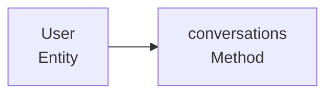
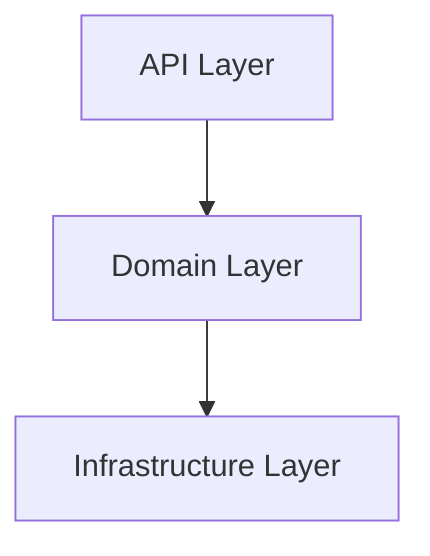

# 知识图谱提取器 - 本地使用指南

本指南介绍如何在 IntelliJ IDEA 中本地使用知识图谱提取器，无需依赖 Neo4j 数据库。

## 功能特性

✅ **架构可视化** - 查看三层架构（API、Domain、Infrastructure）的整体结构
✅ **代码导航** - 点击 Mermaid 图表中的节点，直接跳转到源代码文件
✅ **查询分析** - 快速查找常见模式和架构问题
✅ **影响分析** - 追踪修改某个节点会影响哪些其他节点
✅ **本地使用** - 无需 Neo4j，完全本地运行
✅ **多格式导出** - 支持 Mermaid、JSON、HTML、Markdown 多种格式

## 前置要求

1. **IntelliJ IDEA** (推荐 Ultimate Edition，Community Edition 也可)
2. **Mermaid 插件** (必须安装)
3. **Java 17+**
4. **Gradle 8.10**

## 安装 Mermaid 插件

1. 打开 IntelliJ IDEA
2. 进入 `Settings` (Windows/Linux) 或 `Preferences` (macOS)
3. 选择 `Plugins` → `Marketplace`
4. 搜索 `Mermaid`
5. 点击 `Install` 安装官方 Mermaid 插件
6. 重启 IntelliJ IDEA

## 快速开始

### 1. 运行提取器

```bash
# 从项目根目录运行
./gradlew :tools:knowledge-graph-extractor:extractToLocal
```

### 2. 查看生成的文件

提取器会在项目根目录下生成 `knowledge-graph` 文件夹：

```
knowledge-graph/
├── architecture.md              # 架构视图（三层架构）
├── api-to-database.md          # API → Database 完整流程
├── smart-domain.md             # Smart Domain 关联模式
├── full-graph.md               # 完整图谱
├── graph.json                  # 完整图谱 JSON 数据
├── nodes.json                  # 所有节点的 JSON 数据
├── relationships.json          # 所有关系的 JSON 数据
├── statistics.md               # 统计信息
└── interactive.html            # 交互式 HTML 视图
```

### 3. 在 IntelliJ IDEA 中查看

1. 在 IntelliJ IDEA 中打开生成的 Mermaid 文件（如 `architecture.md`）
2. 点击右上角的 `Preview` 按钮预览图表
3. 点击图表中的节点，跳转到对应的源代码文件

## 使用说明

### 架构视图 (architecture.md)

显示整个应用的三层架构：

- **API Layer**: JAX-RS 资源和 HATEOAS 模型
- **Domain Layer**: 实体、DTO、领域接口
- **Infrastructure Layer**: Mapper、XML 配置、数据库表

**使用场景**：

- 理解项目的整体架构
- 查看跨层的依赖关系
- 识别架构分层是否合理

### API → Database 流程 (api-to-database.md)

追踪从 HTTP 请求到数据库操作的完整流程：

```
API Resource → Entity → Mapper → Database Table
```

**使用场景**：

- 理解请求的处理流程
- 定位性能瓶颈（N+1 查询问题）
- 追踪数据库操作的来源

### Smart Domain 模式 (smart-domain.md)

展示 Smart Domain DDD 的关联对象模式：

```
Entity → Association Interface → Association Implementation → Mapper → XML Mapper
```

**使用场景**：

- 理解 Smart Domain 架构
- 追踪关联模式的实现
- 学习如何使用 HasMany 接口

### 交互式 HTML 视图 (interactive.html)

在浏览器中打开，提供：

- 多标签页切换不同视图
- 节点列表和详情
- 图表交互式展示

## 查询分析

### 运行单个查询

```bash
# 查找 API → Domain 流程
./gradlew :tools:knowledge-graph-extractor:extractToLocal -Dquery=api-to-domain

# 查找 Smart Domain 关联
./gradlew :tools:knowledge-graph-extractor:extractToLocal -Dquery=smart-domain

# 查找架构违规
./gradlew :tools:knowledge-graph-extractor:extractToLocal -Dquery=violations

# 分析影响范围
./gradlew :tools:knowledge-graph-extractor:extractToLocal -Dquery=impact -Dnode=ENTITY:User

# 查找未使用的实体
./gradlew :tools:knowledge-graph-extractor:extractToLocal -Dquery=unused
```

### 运行交互式查询

```bash
./gradlew :tools:knowledge-graph-extractor:queryAnalysis
```

在交互式模式下，可以使用以下命令：

```
> api-to-domain      # 查找 API → Domain 流程
> smart-domain       # 查找 Smart Domain 关联
> violations         # 查找架构违规
> impact ENTITY:User # 分析 User 实体的影响范围
> unused            # 查找未使用的实体
> node ENTITY:User   # 查看节点详情
> incoming ENTITY:User # 查看 User 的入边关系
> outgoing ENTITY:User # 查看 User 的出边关系
> stats              # 查看统计信息
> help               # 显示帮助
> exit               # 退出
```

## 常见使用场景

### 场景 1：新成员入职

```bash
# 1. 运行提取器
./gradlew :tools:knowledge-graph-extractor:extractToLocal

# 2. 在 IntelliJ IDEA 中打开 architecture.md
# 3. 查看 Preview，了解整体架构

# 4. 打开 api-to-database.md，理解请求流程
# 5. 打开 smart-domain.md，学习关联模式
```

### 场景 2：代码重构

```bash
# 1. 分析影响范围
./gradlew :tools:knowledge-graph-extractor:extractToLocal -Dquery=impact -Dnode=ENTITY:User

# 2. 查找所有依赖 User 的节点
# 3. 评估重构风险

# 4. 检查架构违规
./gradlew :tools:knowledge-graph-extractor:extractToLocal -Dquery=violations
```

### 场景 3：性能优化

```bash
# 1. 打开 api-to-database.md
# 2. 追踪 Mapper → Database 关系
# 3. 查找可能存在 N+1 查询的地方
# 4. 分析 Entity → Mapper 的调用链
```

### 场景 4：代码审查

```bash
# 1. 生成架构视图
./gradlew :tools:knowledge-graph-extractor:extractToLocal

# 2. 检查新代码是否符合架构
# 3. 检查是否有架构违规
./gradlew :tools:knowledge-graph-extractor:extractToLocal -Dquery=violations

# 4. 检查是否有未使用的代码
./gradlew :tools:knowledge-graph-extractor:extractToLocal -Dquery=unused
```

## 代码导航

### 点击节点跳转

在 Mermaid 图表的预览中：

1. 点击任意节点
2. 如果节点有文件路径，会自动跳转到源代码文件
3. 如果是方法节点，会跳转到方法定义

### 示例



## Mermaid 配置

### 使用 ELK 布局（推荐用于大型图表）

在生成的 Mermaid 文件中，可以修改配置使用 ELK 布局算法，以获得更好的可读性：

```mermaid
---
config:
  theme: forest
  layout: elk
  elk:
    mergeEdges: true
    nodePlacementStrategy: LINEAR_SEGMENTS
---
```

### 切换主题

支持的主题：

- `default` - 默认主题
- `base` - 基础主题
- `dark` - 深色主题
- `forest` - 森林主题（推荐）
- `neutral` - 中性主题

## 高级用法

### 自定义输出目录

```bash
./gradlew :tools:knowledge-graph-extractor:extractToLocal -Doutput.dir=/path/to/output
```

### 自定义项目路径

```bash
./gradlew :tools:knowledge-graph-extractor:extractToLocal -Dproject.path=/path/to/project
```

### 仅导出特定视图

修改 `LocalGraphApplication.java`，注释掉不需要的导出功能。

## 故障排除

### 问题 1：Mermaid 图表无法显示

**解决方案**：

1. 确保已安装 Mermaid 插件
2. 重启 IntelliJ IDEA
3. 检查 Markdown 文件格式是否正确
4. 尝试关闭 Preview 再重新打开

### 问题 2：点击节点无法跳转

**解决方案**：

1. 确保节点有文件路径
2. 检查文件路径格式是否正确（使用 `file:///` 协议）
3. 确保 Mermaid 的 `securityLevel` 设置为 `loose`

### 问题 3：大型图表渲染缓慢

**解决方案**：

1. 使用 ELK 布局算法
2. 拆分为多个子图
3. 减少显示的节点数量
4. 在浏览器中打开 `interactive.html` 查看

### 问题 4：提取器找不到 Java 文件

**解决方案**：

1. 确保项目路径正确
2. 检查 `libs/backend/` 目录结构
3. 确保 Java 17 已安装
4. 检查 Gradle 版本是否为 8.10

## 最佳实践

### 1. 定期运行提取器

在代码变更后运行提取器，保持知识图谱最新：

```bash
./gradlew :tools:knowledge-graph-extractor:extractToLocal
```

### 2. 使用版本控制

将生成的 Mermaid 文件提交到 Git，方便回溯和对比。

### 3. 结合 CI/CD

在 CI 流程中运行提取器，自动检测架构违规：

```yaml
- name: Extract Knowledge Graph
  run: ./gradlew :tools:knowledge-graph-extractor:extractToLocal -Dquery=violations

- name: Check for Architecture Violations
  run: if [ -s knowledge-graph/queries/architecture-violations.md ]; then exit 1; fi
```

### 4. 文档集成

将 Mermaid 图表嵌入项目文档：

````markdown
## 架构设计

项目采用三层架构设计：


````

详细架构图请参考 [architecture.md](knowledge-graph/architecture.md)。

```

## 与 Neo4j 版本的对比

| 特性 | 本地版本 | Neo4j 版本 |
|------|---------|-----------|
| 需要数据库 | ❌ 不需要 | ✅ 需要 Neo4j |
| 代码导航 | ✅ 支持点击跳转 | ⚠️ 需要手动跳转 |
| 查询语言 | ❌ 预定义查询 | ✅ Cypher 查询 |
| 性能 | ✅ 快速启动 | ⚠️ 需要启动 Neo4j |
| 可视化 | ✅ Mermaid 图表 | ✅ Neo4j Browser |
| 交互性 | ✅ HTML 交互 | ✅ Neo4j Browser |
| 部署 | ✅ 简单 | ⚠️ 需要部署 Neo4j |

## 下一步

- 查看 [README.md](../README.md) 了解提取器的更多功能
- 阅读 [IMPLEMENTATION.md](../IMPLEMENTATION.md) 了解实现细节
- 探索生成的 `knowledge-graph/` 目录中的其他文件

## 反馈与问题

如果遇到问题或有改进建议，请提交 Issue 或 Pull Request。
```
